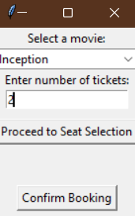
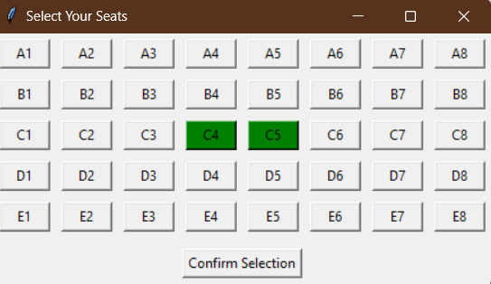
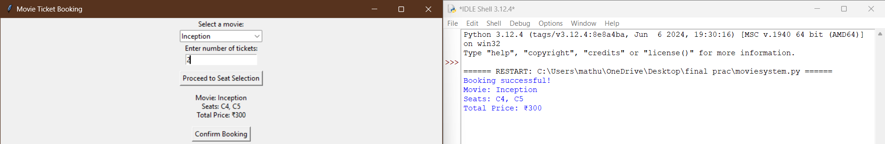
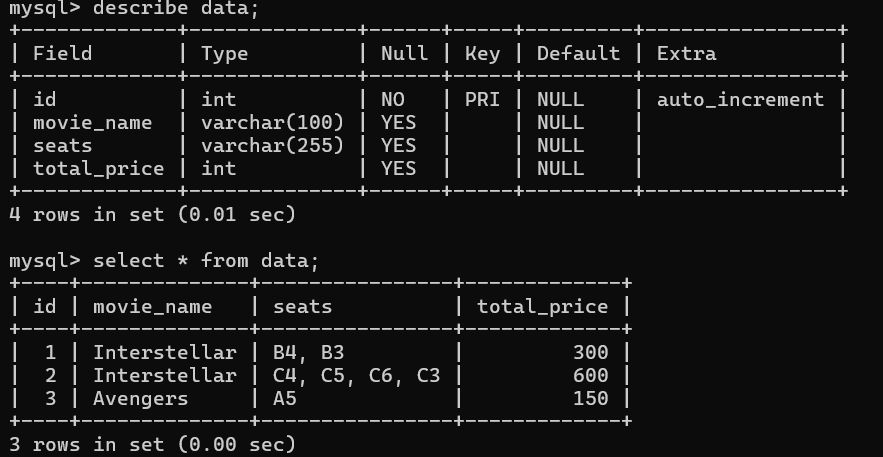

# 🎟️ Movie Ticket Booking System

**Key Points:**
Developed a GUI-based movie ticket booking system using Tkinter & Python.
Integrated MySQL database for storing booking details (movie name, seats, total price). 
Implemented CRUD operations (Create, Read, Update, Delete) for database management.
Designed an interactive seat selection system with real-time data storage.

A simple **Python-based movie ticket booking system** using Tkinter, where users can:
- Select a movie from a dropdown menu.
- Enter the number of tickets.
- Choose their seats from an interactive seat layout.
- See booking details and confirm their reservation.
- Retrieve stored bookings and query specific reservations. (UPDATE)

## 📸 Screenshot




### 🗄️ Database Integration  
**Booking data is stored in MySQL, allowing retrieval & management.**  
  

## 🛠️ Technologies Used
- **Python** (Core logic)
- **Tkinter** (GUI for seat selection)
- **MySQL** (Database for storing bookings)
- **MySQL Connector** (For Python-MySQL interaction)

## 🚀 How to Run
1. Clone this repository.
2. Navigate to the project folder.
3. Run the script.

   ```bash
   git clone https://github.com/mathur458/Movie-Ticket-Booking.git
   cd Movie-Ticket-Booking
   python movie_booking.py
   ```
4. Database Integration
   ```bash
   pip install mysql-connector-python
   ```
  MYSQL:
   ```bash
   CREATE DATABASE MovieBookingDB;
   USE MovieBookingDB;

   CREATE TABLE bookings (
       id INT AUTO_INCREMENT PRIMARY KEY,
       movie_name VARCHAR(100),
       seats VARCHAR(255),
       total_price INT
   );
```
  
## 💡 Future Improvements
- 🔒 Seat Blocking System – Prevent multiple users from booking the same seat.
- ☁ Move Database to Cloud – Host MySQL on AWS or Google Cloud.
- 💳 Add Payment Gateway Simulation – Simulate payments.

👩‍💻 Developed by **Deeya Mathur**
